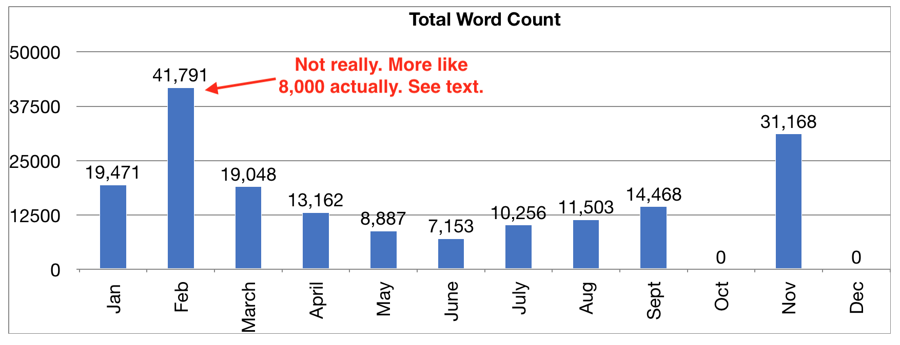

So much can change in a year!

This has been a year of massive change for me, and we'll discuss that below. But
first, I participated in National Novel Writing Month again this year, and as
last year, this is my report on how I performed. Short story: I didn't "win" by
writing fifty thousand words, but I did make a very good showing. Here's my word
count graph for 2018.

As you can see, my NaNoWriMo project capped out at 31,168 words. Not bad. I
drafted twenty-one days in November, so my average was below the required
"winning" pace. Still, I averaged a thousand words per calendar day, and I feel
pretty good about that.

<h2>2018: The Big Year</h2>
I started 2018 by getting laid off from my job. Most people consider that a big
"suck" life event, but for me, it was kind of a relief. I had worked there more
than a decade, and over the last 3 years there, massive changes at the company
had sucked away most of the joy of my job. I was tired of it, and I needed a
change.

I found myself in a very lucky position. I had a severance package and resources
of my own, so I didn't need to go find a job immediately. I was burned out on
the corporate world and could not face another "enterprise IT" job. I decided
instead that I would try to live the dream, and work on my author career full
time for a while.

The first four months of the year were extremely productive. I had no day job to
interfere with my writing. I did my edits and rewrites on <a
href="https://vince.veselosky.me/seers-guild/cursing-fate">Cursing Fate: The
Piero Codex Book One</a> in January. In February, I picked up my half-finished
draft of <a
href="https://vince.veselosky.me/seers-guild/shifting-loyalties">Shifting
Loyalties: The Piero Codex Book Two</a>. I tried, as an experiment, tracking
words on edits and rewrites, but in practice I discovered that it threw my
numbers way off. Although I recorded 41k words in February, I only actually
produced around 8,000 words of draft. The rest was pre-existing draft that was
edited. Live and learn.

With my outline newly revitalized, I dove into drafting Book Two, and finished
it in mid-April. During those months, I also registered an LLC, established
relationships with the online ebook retailers, ordered ebook covers for the
series, and generally got my publishing business ready for action. I ambitiously
created a release plan for the series to release one a month, scheduled the
first release for may, and started working on Summoning Courage: The Piero Codex
Book Three.

<h2>Nothing Is Ever Easy</h2>
And then reality happened. Book Three fought me from the very beginning. I was
never satisfied with the outline, and the early draft just was not working. I
got Book One published in May. Took a break from the draft to do my final
revisions on Book Two, which turned out great, except that most of my readers
didn't get to see that final polish because Amazon and I had a misunderstanding
about publishing dates and final copies. That frustrated me even more, and made
it that much harder to get Book Three moving in the right direction.

As had happened with the first two books, I reached a point near the middle of
book three when I realized the outline needed a complete overhaul, and I was not
going to hit my ship dates. That major slowdown in the May-June-July timeframe
was me struggling to fix the outline and get back on track.

I finally did reach an outline that I could live with, and started rebuilding
momentum. This was made difficult by the fact that I was starting to run low on
money and started looking for a day job I would not hate. Not an easy task. I
was dividing my time between writing, job hunting, and working to level up my
software development skills (in aid of the job hunt).

I finished the draft of Book Three on the last day of September, just under the
wire to meet my revised Q3 delivery target.

The draft was very rough, and I knew it needed a lot of revision before it could
be published. I had to make a choice. If I worked on the revisions in October,
they would drag into November, and I would be completely unprepared for
NaNoWriMo. I would not be able to participate, and that idea made me sad.

The book was already late, and my twenty or so readers knew that. I shrugged,
said what the hell, and put Book Three on a shelf to spend October preparing for
NaNo.

<h2>How I "Failed" at NaNoWriMo</h2>
I had already selected a new character and story for my next project. I knew
from experience that I needed a strong outline if I was going to hit high word
counts on my first draft, so I spent most of October filling whiteboards with
plot points and character arcs. I worked HARD for two weeks. I spent no time
drafting, only outlining. I got to a point where I had an outline I considered
draftable.

I would like to have spent two more weeks on the outline. The first half of the
outline was solid and complete, sixteen strong scenes and two that needed a
little TLC. The second half had a lot of scenes with vague or missing turning
points, and a few that remained one-liners. Unfortunately (or fortunately), my
job hunt came to an end, and I found myself with a full time day job again.

Starting the new job didn't just consume my daytime hours. The commutes were
long. I had to worry about planning meals again, instead of just walking to the
fridge. I was learning a new codebase, learning to work with a new team, using a
new process, and trying to make a good impression. It was exhausting. And the
new hours disrupted my sleep schedule, leaving me even more tired.

For the first couple of weeks of November, I pushed myself hard, and I performed
well. But I could see that my words per hour were on the low side. Extra hours
on the weekends kept me in the race. My outline was holding up. But I wasn't.
The change of weather was giving me headaches and nosebleeds. Then I got food
poisoning, which lost me a whole day and night.

By the week of Thanksgiving, the lack of light, the lack of sleep, and the
stress caught up with me. I was killing myself, and I had to ask myself why. At
this point, I had proven that I could win NaNo. I had proven three times over
that I could complete a novel. I had even proven that I could sell copies books
I had written. I did not need to sacrifice my physical or emotional health to
prove anything.

So I backed off the writing and started working on recovering. It's mid-December
and I still don't have my sleep schedule sorted out, but I am less
sleep-deprived than I was, and on the way to better. I've put this year's NaNo
project on the shelf for a little while. Over Christmas break, I will pick up
Summoning Courage and complete the revisions on that. Then, I will finish the
draft for my new book, hopefully by late January or early February of 2019.

<h2>2018 Lessons Learned</h2>
It was a big year, and I have a lot of lessons learned from it. Here's a
summary.
<h3>Writing fiction is harder than writing code.</h3>
I'm an introvert. People wear me out, and I need alone-time to recharge. Writing
code is something I can do all day. It's like solving a jigsaw puzzle. No people
involved. Not very taxing emotionally.

Writing fiction, on the other hand, is like a family argument times five.
Creating conversations and interactions where I have to carry both sides, to
flesh out the emotional reactions of multiple characters, some (most) of whom
are much more intense than me. I find it utterly draining. Despite the fact that
I had all day to write for much of the year, I seldom spent more than two hours
a day actually drafting. Any more than that, and I found I needed time off to
recover.

Conclusions from that? For starters, full time writer may not be the best career
for me. That doesn't mean I'm going to stop writing. Far from it. But I don't
see myself being one of those prolific authors who publish a book a month.
I'll be happy to produce two books a year for now.

<h3>Sleep is important. Health in general is important.</h3>
If I'm tired or depressed, I simply can't produce good fiction. Creativity
requires vitality, energy, desire. To keep myself writing, I have to accept
my limitations and take care of myself first. And that's something I have
struggled with all my life. Well, that's how it goes. Keep struggling,
Vince!
<h3>I make plot-driven outlines, and character-heavy drafts.</h3>
My process is very plot-driven. I create an outline marking the events of
the external story. Then when I draft it, I internalize the characters,
dramatize their internal reactions. I'm not particularly good at characters.
It's hard work. I enjoy outlining more, because it's less like an awkward
cocktail party and more like architecting software. (What can I say, I'm
weird.)

Maybe I should find a writing partner who is all about character and hates
plotting? I bet we could produce some great stuff together! But I really
need to level up my skills a lot more before I'm ready for that kind of
collaboration.

<h3>I still don't understand the "middle build".</h3>
When it comes to story structure, I feel like I have a solid grasp of Act
One, the first quarter of the story. I think I do alright with that last
quarter, which I tend to write as a fast-paced rush to the climax. But the
middle still baffles me. I'm only just beginning to understand how to
structure progressive plot complications and character arcs to fill the
middle half of the story with compelling reading.

As a result, I think my next project I will spend even more time outlining.
And I will spend more time analyzing great stories to learn from them.

<h2>NaNoWriMo 2019 and Beyond</h2>
After this year's experience, I'm not sure I'll be participating in NaNo
next year. I no longer feel I have anything to prove, and the event is
inconveniently timed for me. It's the time of year I prefer to be ramping
down, not ramping up.

I think instead I will focus on honing my skills and creating books at a
pace I know is sustainable for me. And I will also allow myself to spend
time on other, non-book side projects again. Because I like writing software
too!
