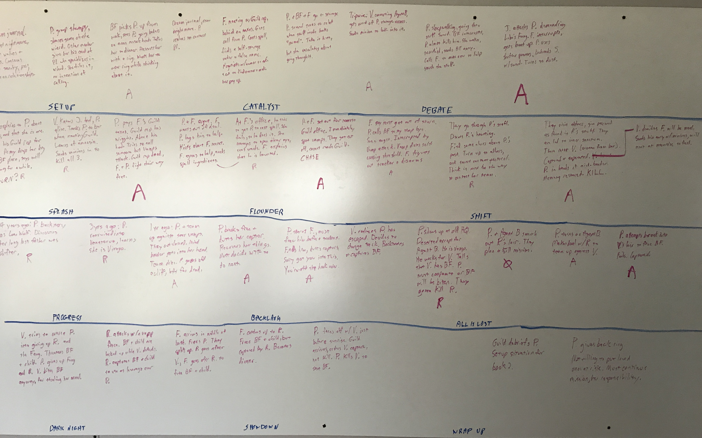

Two years ago I wrote a post about [Creating a Creative
Process](creating-creative-process).
Since then, I have completed three novels and am in production on a fourth, with
many more in the pipeline. I have learned a lot of lessons through trial and
error. I still have a lot more to learn. But after two years, I figured it was
time for an update.

Note that this post is _not_ titled "How To Write a Novel". This is a snapshot
of my own process at a specific time in my writing journey. Maybe it will be
helpful to other writers, but it's not a prescription nor a recommendation. I'm
just sharing my experience.

## Step 0\. From Idea To Project: The Gestational Phase

Like every writer, I have a huge pile of ideas I have jotted down over the
years. Every project begins as at least one idea. But most ideas never go into
projects. I like to pull elements out of stories I like, or out of stories I
don't like that I think I could tell better. I spend a lot of time mulling,
recombining pieces to see what could be constructed from them.

An idea doesn't turn into a project until I have nailed down three important
aspects of the story:

1.  The Premise (Why): What's the thing that makes it worth my time to write?
2.  The Genre (What): I will never again begin earnest work on a project without
    identifying the genre I'm targeting. I currently use the Story Grid
    definitions of Genre, but I also consult Save the Cat's ten types of
    stories, Amazon categories, and other definitions of genre. This defines
    what _kind_ of story I want to tell, and creates some constraints on
    structure and conventions.
3.  The Main Character (Who): I need to have at least one of the POV characters
    "figured out" before I can begin. They don't need to be fully fleshed out,
    but I need to have a sense of their personality and emotional journey, or
    else anything I write is going to sound flat and bland (I know, I tried it).

This phase has no time bound. For some projects it is infinite, for others, a
few months. Years will not be unusual, because I can only work so many projects
in a year.

## Step 1\. The Board: The Story Forming Phase (2-8 weeks)

I have a confession that may shock and dismay. I don't enjoy drafting. Drafting
is the "writing" part of writing, where you type out all those damn words. I
don't hate drafting, but I don't like it. To me, drafting is the scut work, the
drudgery that simply must be done to produce the product. Some writers _love_
drafting, and their process turns entirely around that activity. They write a
draft, and then revise it with further drafts three or five or seven times. My
process is designed to keep drafting to an absolute minimum. I don't want to
write anything more than once!

<figure class="alignright
is-resized">

<figcaption>SPOILER ALERT! "The Board" for my current work in
progress.</figcaption>

</figure>

Therefore, step one is to create an outline. There are as many ways to create an
outline as there are outliners. I have adopted a slightly modified version of
The Board as described in [Save the Cat](https://amzn.to/2Rwijjl). The story is
laid out in a grid with four rows, each representing 25% of the story. In my own
head I refer to these as "acts" but that tends to confuse (or anger!) people who
cling religiously to the Three Act Structure, so I'll just call them quarters.

This grid layout is an excellent visualization for story structure, because the
most significant events of the story will form a nice tidy column down the right
side of the grid (these are the "plot points" or major turns and the climax).
The second-tier events of the story (the "pinch points") will likewise be lined
up down the middle of the grid. The setup work will be lined up in the left
column. The spaces between are the connective tissue of the story. This gives a
story that is well-paced. Snyder recommends doing this with notecards. I have
been writing them on a whiteboard. It's the layout, not the medium, that
matters.

What I do at the board is what many writers do in their first and second draft.
I figure out what happens, and why, and to whom. I typically work from right to
left. What are the big events and major turns? What are the complications that
lead up to them? What setup do I need to get there? I decompose the story into
acts, sequences, and scenes. In the beginning it's a lot of scribbling, but
before long it coalesces into a solid outline.

At the end of this process, I have enumerated all the major characters and
turned my general idea into a list of scenes that should flow logically from
beginning to end.

It's difficult to say how long this phase truly lasts, since I have only
recently adopted this technique. For my current work in progress, I spent two
full weeks working on it a couple of hours a day, so maybe thirty working hours?
But that plot was already well-developed in my head before I began outlining.
And in future I intend to be even more thorough in this phase, so probably
longer. I imagine some projects will require eighty hours or more.

## Step 2\. The Half Draft (4-8 weeks)

Now begins the drafting phase. I begin to draft the scenes, one at a time, from
beginning to end, in order. I will explore the inner lives of the characters,
add color and personality quirks, invent settings, develop the voices, etc.

In this step I will draft somewhere between 25% to 50% of the words. And then I
will stop.

By this point, I will have discovered several problems with my original outline.
Maybe I need an additional scene to drive the motivation of a character. Maybe I
missed an obvious "why don't they just" solution to the character's problem that
needs to be explained away or blocked by new complications. Maybe I discover
that a planned solution to a problem won't actually work and have to resolve
that.

Probably I have added several new setups during drafting whose payoffs will need
to be added to the outline. Conflict threads will have developed that will need
to be wrapped up somehow at the story's conclusion. The exact order of events
may shift.

In short, before I can finish the draft, I need to go back and revise my
outline.

The half-draft typically takes 1-2 months at my current drafting pace.

## Step 3\. Back To The Board (2-8 weeks)

I put the draft away for a time and return to my outline. I have a list of
problems to sort out, some gaps to fill, some weak scenes to prop up, replace,
or remove. The climax, which has been somewhat abstract, now begins to take on
very specific forms.

I bang my head against the board until I'm satisfied that the story is right.

This step may last a few weeks or a few months, depending how badly I have
botched the original outline, or how tight the corner is that I have painted
myself into.

## Step 4\. The "First" Draft (4-8 weeks)

Having revised my outline, I return to drafting. If necessary, I will perform
some revision on existing scenes from the Half Draft, but more typically I will
simply make notes about changes that need to be made and continue from where I
left off, drafting the scenes in order until I complete the draft.

I label this the First Draft, but note that by this point the story has been
revised multiple times already. This is where many writers (pantsers) will be on
a Third Draft or later.

Finishing the draft takes 1-2 months.

## Step 5\. Have a Drink: The Fallow Period (2-8 weeks)

I have a special bottle of bourbon that I only open when I hit a writing
milestone. Finishing a First Draft is one such milestone, so I pour one, make
toast to my hard work, and enjoy the feeling of being done with something big.

Then, I put the draft on the shelf for a while and think about something else.

This step may last a couple of weeks, or a couple of months, depending what else
I have going on, and how tired I am of looking at the pages!

## Step 6: The Read Through (1 week)

Next, I pick up the draft again and simply read it through, from beginning to
end. I make notes of any issues I find: plot holes, character inconsistencies,
poorly worded passages, lame metaphors, etc. I explicitly do not attempt to fix
any of these issues in this step, only identify them.

When I say that I make notes, I'm talking specifically about Scrivener's
"comments" feature that allows you to attach a comment to any arbitrary
selection of text. Those comments become my To-Do list in the revision stage.

I also leave comments when I'm drafting, because struggling to find the right
word in the moment often becomes a form of resistance. Drafting notes I leave
myself are things like [describe clothing] and [opposite of steep?].

My books are not terribly long, to date, so the read through usually takes just
a few days.

## Step 7\. The First Revision (1-4 weeks)

Next I work my way through the book, finding all the annotated passages (the
Scrivener comments), and correcting the issues one at a time. I tend to write
short in my first draft, so this almost always involves adding words to the
draft, not trimming.

Depending on how many problems I found, the first revision may take a week or up
to a month.

## Step 8\. Other Eyes (2-4 weeks)

At this point I have made the project the best I can make it by myself. Time to
ship it off to the editor and/or beta readers and see what they think.

I will get back a list of notes and suggestions, which I review. I need to
decide first, whether the issue is really a problem. Second, is it something
that I believe I should fix? I'm unlikely to embark on a total rewrite or major
plot change at this stage. Third, how should I fix it? I make more notes.

## Step 9\. The Final Revision. (1-4 weeks)

As in Step 7, I work through the notes one by one until they are all fixed.

Again, the final revision may take a week or a month depending on the number of
issues to be corrected.

## Step 10\. The Polish (1-2 weeks)

The Polish step is where the manuscript gets cleaned up and turned into a
product. There are a few processes I go through to polish, all of them pretty
simple.

- I have the computer read it to me. Running the full text through my Mac's text
  to speech engine, I hear things that I would not notice myself: strange
  inflections, odd word combinations, passages that could be misread, skipped
  words, doubled words. When reading by eye, you can skim right over these
  things, but the computer will read them exactly as they appear on the page,
  and errors will sound jarring.
- I read it aloud to myself. It's surprising how many copyediting issues can be
  discovered and resolved by reading the work aloud. I make lots of line
  revisions here. This is different from having the computer read to me. When
  the computer reads, it's about correctness. When I read myself, it's about
  refining the authorial voice.
- I run it through a grammar and style checker. I use [Pro Writing
  Aid](https://prowritingaid.com/), but there are other similar tools. I use
  this to fix word choice issues, grammar, spelling, and punctuation.
- I export the text from
  [Scrivener](https://www.literatureandlatte.com/scrivener/overview) (where all
  my work has happened until now) to MS Word and run it through Word's spelling
  and grammar checker, just to be safe. Inevitably, there are some issues to be
  fixed.
- Formatting: I import the final MS Word file into [Vellum](https://vellum.pub/)
  to format the ebook and print version, add front matter and back matter, and
  finish the design.

This step doesn't require much creative work, and it typically takes two weeks,
but can be done in one week if I have enough free time.

## Have Another Drink

At this point, the creative process is done, and the business process is just
beginning. I have another drink of my special bourbon to celebrate a completed
work, publish that puppy, and do whatever is next.

That's the full skinny on my creative process, as of the beginning of 2019\. As
you can see, it has evolved a great deal over two years of steady writing. I
know the process will continue to evolve as I level up and discover new
refinements.

I hope that some other writers find this helpful, and that curious readers now
have a little better understanding of what goes into producing a novel. Let me
know what you think!
