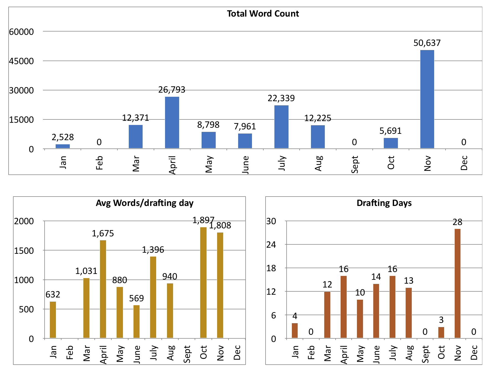

I wanted to record for posterity my first experience of "winning" National Novel
Writing Month. As you may know, NaNoWriMo is a self-challenge to write 50,000
words in 30 days.

Throughout 2017, I have been tracking my writing statistics (screenshot
provided). As you may see from the screenshot, before November, I never got
anywhere near 50k words in a single month. So I took NaNoWriMo 2017 as a true
challenge to get my word counts up and make some real progress, to prove to
myself that I could truly improve both speed and quality.

<!--more-->
<h2>Background: The Story So Far</h2>

The novel I worked on in November 2017 was not my first. I started a novel back
in November 2014, but did not win NaNo, or even come close. What I learned from
that experience is that drafting a novel (what most people call "writing") takes
preparation. I needed to know my characters, and my plot, better, or else I
would spend all my writing time noodling around, doing "research" on the
Internet (read "following Wikipedia links for hours"), and doing almost anything
except actually producing publishable words on the page.

After struggling with that book for two years, I decided I needed a break. Not a
break from writing, but a break from that particular book. The style and subject
I had chosen for that book made it a very time-consuming task, and I wasn’t
accelerating. I knew I needed to accelerate if I was ever going to reach my
final production goal of producing four books a year.

So in 2017, I changed tacks. I also changed projects, and characters, and
genres, and writing styles. Most importantly, I changed my focus. I put aside
all my other optional projects so I could focus on writing.

If you look at my word count charts, they illustrate the story. In January, I
wrote a scene. I had just read <a href="http://amzn.to/2nT1PnK">Farewell My
Lovely by Raymond Chandler</a> (if you listen to audio books, this one should
not be missed), and I wanted to experiment with writing in that style. First
person, but without internal monologues. Filled with over-the-top, sometimes
hilarious metaphors and similes. Varied sentence length that leaned heavily to
the short side. Characters that were hard, and dark, and mysterious.

So, I wrote a scene, off the top of my head, focusing on the style and letting
the content be just whatever popped into my head. Didn’t matter if it made
sense.

Long story -&gt; short, I liked the output, and wanted to do more. But I now had
this scene, and these characters, and all these little hints in the scene about
secrets, and I didn’t know where any of it went! After that scene, I understand
the thrill that "pantsers" have when they are writing. (And after working on the
full project, I understand why I will never be a pantser.)

That gap in drafting in February is partially time I spent trying to flesh out
the world, the characters, and the story that was born in that first scene. (And
partially that I had no time to write because I just moved into a house while it
was still under remodel, and it was cold, and the heat wasn’t working yet.
Sigh.)

In March, I had produced an outline, I had a draft target of 55,000 words, and I
was ready to go. I also decided to be meticulous about tracking my writing
progress, because I’m a big nerd. My naive goal was to produce an average of
1,000 publishable words each day. Still not there. But getting better.

Through March, April, and May, I worked on my first draft. As you can see from
the chart, April was the stand-out month for me. I had 16 writing days, and my
per-day average was far higher than before. That’s because I created (what I
thought was) a solid outline of the book before I started drafting. I knew where
the story was going, so each day when I sat down, I knew exactly what I needed
to work on. And, check it: I finished the book! Woohoo!

Lessons learned from the first completed book:

<ol>
    <li>The draft came in about 20% shorter than I had planned. Apparently I am
    a "short writer". Revisions need to add words more than remove them. That’s
    cool. Good to know.</li>
    <li>There was a point in the middle where the outline fell apart. I had
    to stop drafting and start outlining again. I would need more-detailed
    outlines in future.</li>
</ol>

I spent the rest of May and most of June revising and adding to the
book. That’s why the word counts per day are much lower there. I was
doing as much reading as writing, and I was padding out and enhancing
scenes rather than writing them from whole cloth.

In June, I spent a couple of weeks outlining a sequel. In July I
commenced drafting the sequel. July and August were good months for
drafting. At the end of July, I looked back at my stats. I found that my
words per day were pretty solid, but I wasn’t hitting my desired average
over time, because I was not getting enough drafting days in. So I
decided that, in August, I would focus on writing every single day, and
not care so much about word count. I did really well on that for the
first thirteen days of the month.

And then my outline blew up again. So I stopped writing, and went back
to the drawing board to figure out what to write.

<h2>The Run-up to NaNoWriMo</h2>

By the time I had that outline fixed, I realized that I only had a
couple of months to go before NaNo. I was determined to win NaNo this
year with what I learned. I knew to win, I needed to have a really
thorough outline. I knew my timing would be off if I continued with the
current project, so I shelved it. (Sorry Tracy! I will finish it, I
promise!)

I started researching for my epic fantasy series. (How do you research
fantasy? More about that in a future post.) Then, I started building an
outline. I built it first using the same basic process as before, just
make a card for each event. But I had learned that an event is not
necessarily a scene or a chapter. Sometimes, it’s just a page, or a
sentence. So then I went back, and started stacking those events. New
Stuff:

I made a list of POV characters and assigned scenes to them.

I reshuffled the outline to get thematic alignment between the story
threads.

I ran it through the Story Grid and Save the Cat frameworks to make sure
I was hitting the right beats. I even looked at it through the lens of
Dramatica (more on that in another post too). I added scenes and
characters to bring it into alignment.

Once I had beaten the book outline into submission, I went back to the
beginning and started outlining each individual scene, making sure it
had an inciting incident, a turning point, an emotional charge, and as
much as possible, a dramatic conflict.

Three days before November began, I could see that I was not going to
finish my individual scene outlines in time. I had 42 of them to do, and
each one was taking about an hour. I decided I would create them as I
went along.

Since my outline called for an 82,000 word draft, I decided to go ahead
and start drafting.

<h2>Thirty Days of NaNoWriMo</h2>

The first few days, I was drafting scenes for which I had created scene
outlines. This was so easy it felt like cheating. I already knew the
emotional content, the character conflicts, the implications for future
chapters. I blasted through my target word counts each day. The first
day I missed target was the 7th, but that was because somebody broke
into my house and tossed the place while I was at work, and I had to
spend my writing time dealing with that. (Real life sucks.)

Couple of days later, my scene outlines ran out, and I had only
single-paragraph descriptions to work from for each scene. Some of those
scenes were already well-formed in my mind, and those days produced more
than 2,000 words. Other scenes still needed the outline work put in, and
on those days, I struggled. Even on the slow days, though, I was usually
able to break at least 1,000 words.

For most of the month, I was well ahead of the target curve. But, life
happens. I had a couple of days when I was too busy to write, and a
couple that produced very few words, because of reasons. I was falling
behind. But I was so close!

To make sure I caught up, I decided to switch from my linear approach
(writing scenes in the order they would appear in the book) to a
non-linear selection approach (writing scenes that had the strongest
outlines, and connected more directly to scenes already written). In
that way, I was able to power through that last weekend and get back on
top. It took me until the final day of the month, but I did, finally,
cross the 50k mark. I win!

November 2017 was my most productive month ever! I drafted on 28 of 30
days, and yet my average per day was higher than ever before! I
attribute this to the intense work I put into outlining the book, and
then the individual scenes, before the drafting phase began. For my next
book, I will complete the scene-level outlines before I begin drafting.

As I write this, I still have about 25k words to write in the first
draft of this book. And I can tell you, that first draft is rough. It’s
going to need a lot of work. But it’s also clear to me that I am
improving as I go. If I keep working, keep learning, keep accelerating,
I will soon hit that thousand word a day goal. And may even produce a
book worth publishing!
