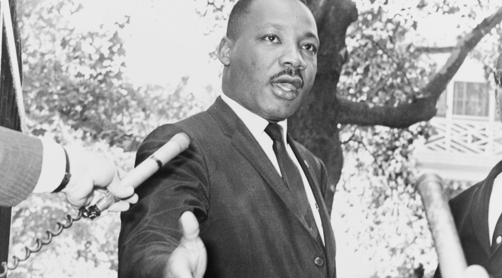

---
itemtype: Item/Page/Article
guid: "urn:UUID:10fb63b9-064f-4ea6-98db-2d0731c9dd73"
Date: 2015-01-19
Category:
    name: Life
    label: life
Title: Martin Luther King Jr. Day
...

Martin Luther King Jr. Day
==========================

As I write this, I sit in an apartment in Atlanta’s Old Fourth Ward,
just a few blocks from where the [Rev. Dr. Martin Luther King
Jr.](http://en.wikipedia.org/wiki/Martin_Luther_King,_Jr.) preached to
his congregation. I cannot express in words the gratitude I feel toward
Dr. King and all the thousands of people who marched with him to demand
equal rights for all Americans. Since its birth, America has been a
nation that aspired to high ideals of equality, and since its birth,
America has struggled and failed to live up to those ideals. People like
Dr. King are the most important people in America, people who serve as a
national conscience, who remind us of the ideals we aspire to, and
insist that we try harder to live up to them. Dr. King made us better as
a nation.

As the events of 2014 made painfully evident, although segregation and
racism are no longer the law of the land, they often remain ingrained in
the structure of our society. Too many people of color continue to
struggle for fair treatment and fair opportunities. We have a long way
to go, and a lot of work to do, before we can say we are living up to
our American ideals.

But growing up, as I did, in the South during the 1970s, attending
elementary school in the recently desegregated school system, I learned
what a huge impact a few dedicated people can have on society and
culture. The cultural difference between the older generation
segregationists and the children who were educated in integrated schools
was nothing short of stunning to me. While racial prejudice has not
disappeared from our culture, that early experience gives me hope that
it really can.

The Martin Luther King Jr. Holiday was [set
aside](http://www.gpo.gov/fdsys/pkg/STATUTE-98/pdf/STATUTE-98-Pg1473.pdf)
to “serve as a time for Americans to reflect on the principles of racial
equality and nonviolent social change espoused by Martin Luther King,
Jr.”

More than a mere day of reflection, the King holiday has evolved into a
national day of service toward the realization of [his great
dream](https://www.youtube.com/watch?v=smEqnnklfYs). The video below
explains the King legacy of service, and how you can honor his memory
and your community through service.

[!embed?max_width=640](https://www.youtube.com/watch?v=PUdPxEn4vnM)

Dr. King was a great orator, and although his written words are
powerful, I don’t believe you can truly understand the power of those
words unless you have heard them as he spoke them. It was not merely the
words, but the passion of his presentation, that motivated everyday
people to extraordinary action during the civil rights era. I believe
everyone should take the time on Martin Luther King Jr. Day to listen to
the man speak.

If you have children, you owe it to them to teach them about Dr. King,
about the struggle for racial equality, and about the nonviolent methods
he used to create such great change. If we are going to make this world
a better place for all of us, we need Dr. King’s leadership and ideals
to live on in future generations.

Here are some places to hear Dr. King speak.

-   [“I Have A Dream” address to the 1963 March on
    Washington](https://www.youtube.com/watch?v=smEqnnklfYs) (YouTube) —
    A must-see.
-   [A Call to Conscience: The Landmark Speeches of Dr. Martin Luther
    King, Jr.](http://www.amazon.com/gp/product/B00005AASL/ref=as_li_tl?ie=UTF8&camp=1789&creative=390957&creativeASIN=B00005AASL&linkCode=as2&tag=mindvessel-20&linkId=7A45BEMX3BIBEUUZ) (Amazon)
    — This audio book contains recordings of Dr. King’s key speeches,
    with introductions from other giants of the civil rights movement.
    It’s very inexpensive. Unfortunately, at the time of this writing
    the [Kindle
    edition](http://www.amazon.com/gp/product/B000Q9IN8G/ref=as_li_tl?ie=UTF8&camp=1789&creative=390957&creativeASIN=B000Q9IN8G&linkCode=as2&tag=mindvessel-20&linkId=2OGDA3TMVKQMN5ZZ)
    is not available with Whispersync, so I recommend the [audio
    edition](http://www.amazon.com/gp/product/B00005AASL/ref=as_li_tl?ie=UTF8&camp=1789&creative=390957&creativeASIN=B00005AASL&linkCode=as2&tag=mindvessel-20&linkId=7A45BEMX3BIBEUUZ).
-   [The Autobiography of Martin Luther
    King, Jr.](http://www.amazon.com/gp/product/B0000547LK/ref=as_li_tl?ie=UTF8&camp=1789&creative=390957&creativeASIN=B0000547LK&linkCode=as2&tag=mindvessel-20&linkId=UU4UYPS3W6OAFBRA) (Amazon)
    — This anthology edited by Clayborne Carson tells the story of Dr.
    King’s life in his own words. The audio edition includes recordings
    of Dr. King himself where available, and is narrated by Levar Burton
    where no recording was available. Again the [Kindle
    edition](http://www.amazon.com/gp/product/B00EXUBXQS/ref=as_li_tl?ie=UTF8&camp=1789&creative=390957&creativeASIN=B00EXUBXQS&linkCode=as2&tag=mindvessel-20&linkId=EQWD7YDOHWYCE4RI)
    is not available with Whispersync, so I recommend the [audio
    edition](http://www.amazon.com/gp/product/B0000547LK/ref=as_li_tl?ie=UTF8&camp=1789&creative=390957&creativeASIN=B0000547LK&linkCode=as2&tag=mindvessel-20&linkId=C54ZMJRHFTTPRKNT).

