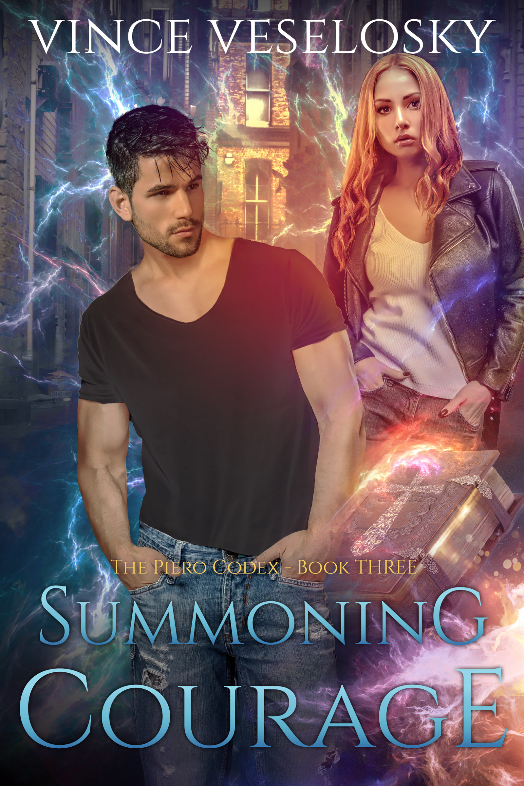

According to Hofstadter's Law, every project takes longer than you expect it to (even when you take into account Hofstadter's Law), and my latest book project is no exception. But, as of today, [Summoning Courage: The Piero Codex Book Three][1] is available at ebook retailers everywhere!

I am delighted to announce the release of this conclusion to The Piero Codex trilogy. These were my first novels, and it has been an incredible learning experience for me to produce them. Those lessons learned will make my next series even better.

Now that the edits are done and the cover is attached, I'm going to take a little break from writing to try to close out another very late project: the remodel of Albatross House. I'm going to stay focused on that project until it's done, so I probably will not be releasing another book in 2019. However, I have about 80 thousand words already banked for my next series; there will definitely be another release in the future!

Thank you for following along with my creative journey. I sincerely hope you are enjoying it!

Your author friend,
Vince Veselosky

[][1]

[1]: https://books2read.com/b/vv-summoning-courage